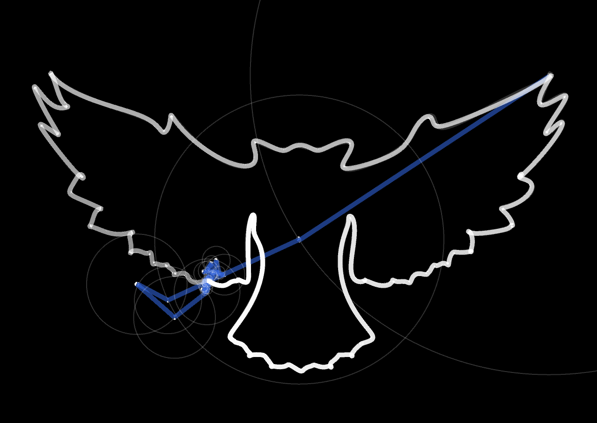

# Fourier series visualisation

This project uses [Processing](https://processing.org/). It was inspired by the animations in [this video](https://www.youtube.com/watch?v=r6sGWTCMz2k) by 3blue1brown, in which a set of arrows rotating at a constant speed and joined head to tail, is used to draw any shape.

Giving an svg file containing one stroke, this program will produce an animation similar that present in the video. It does so in two steps:

1. **Extraction**: (In hindsight, I should have called it parsing) The svg string is parsed to determine the basic shapes that constitute it (straight lines, quadratic/cubic Bazier curves). Then it is converted to an object of type `SVGFunction` that represents a complex-valued function $f: [0,1] \rightarrow \mathbb C$ that "draws" the shape as the input varies between $0$ and $1$.
2. **Calculation of the Fourier coefficient**: the Fourier coefficients are calculated, which determines the radii and the angular speed of all the arrows making the animation.

You can use Z and T to zoom in and out.

